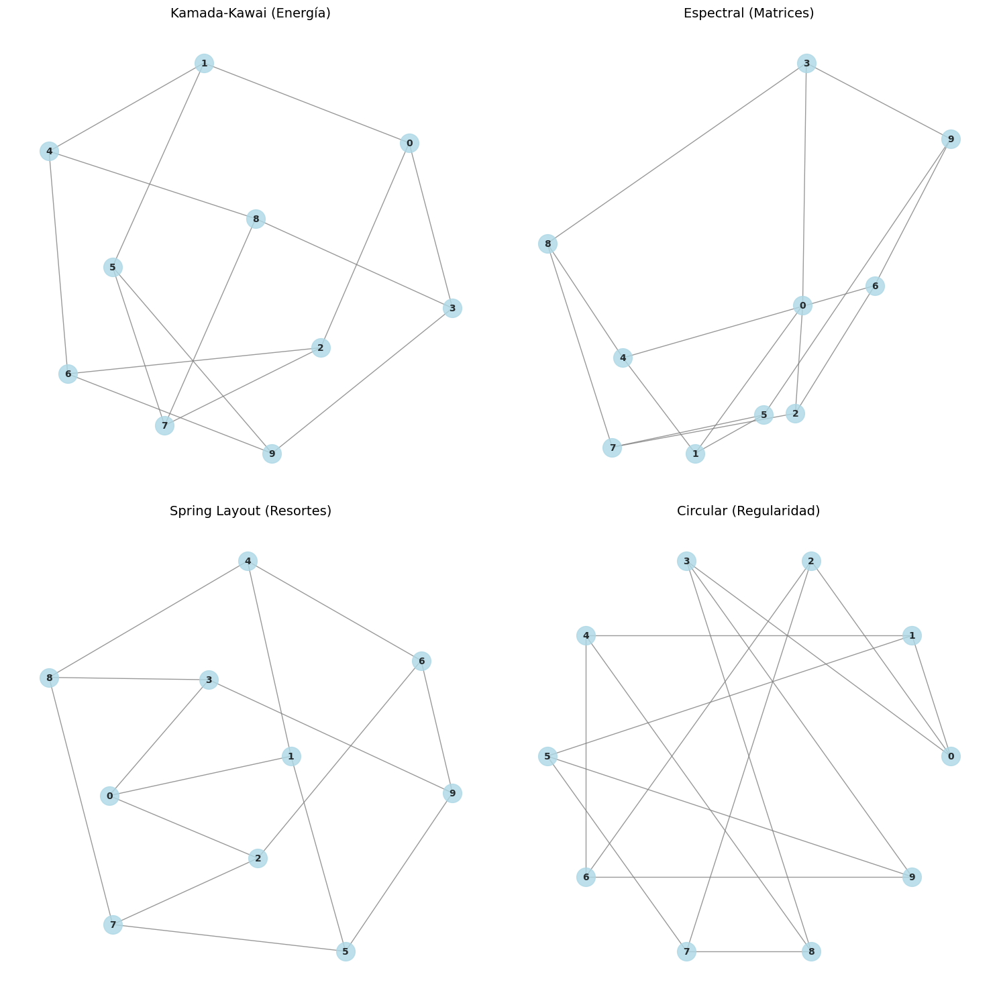
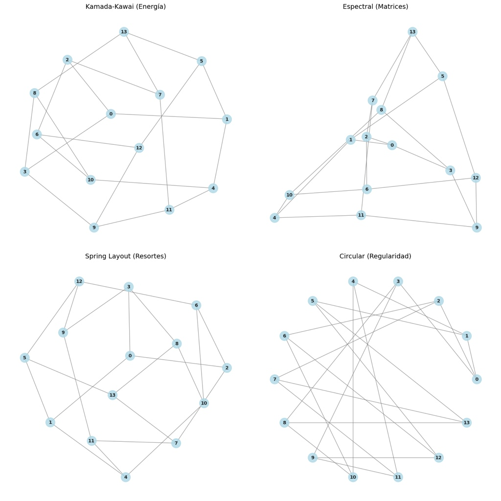
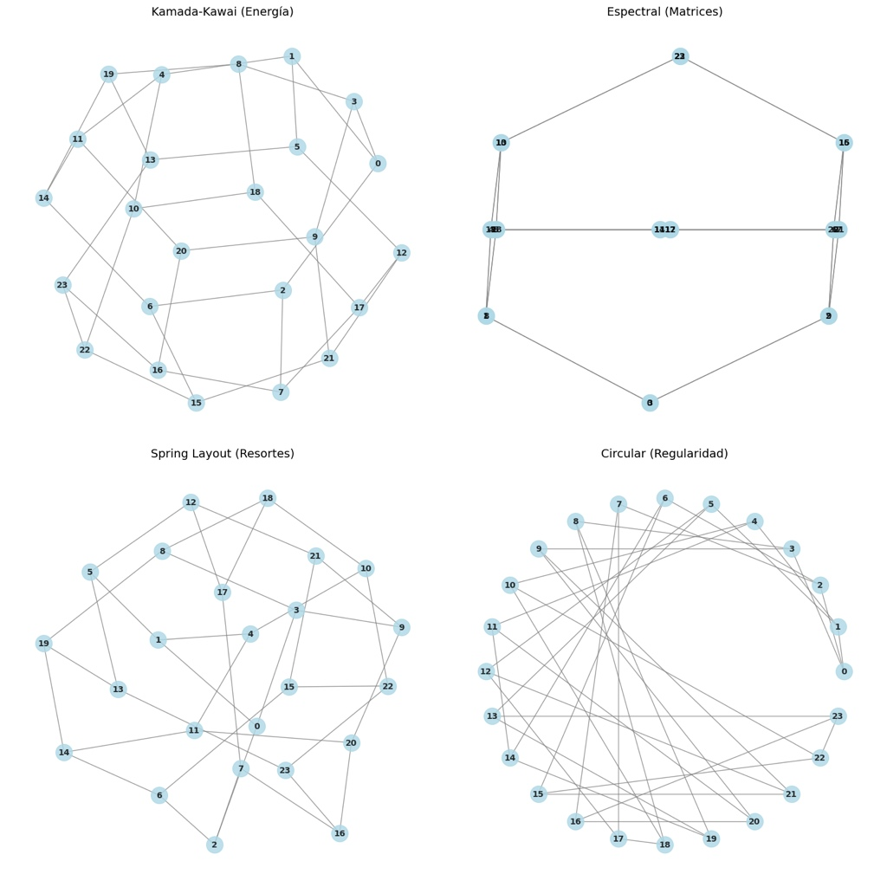

# Resultados del Algoritmo 📊

En esta sección presentamos los resultados obtenidos al ejecutar el algoritmo **Kage** para buscar distintas jaulas conocidas en la teoría de grafos. Gracias a las técnicas de poda implementadas, el algoritmo es capaz de encontrar estas estructuras en tiempos sumamente competitivos.

## Jaulas Encontradas

A continuación se muestra una tabla con algunas de las $(k, g)$-jaulas que el algoritmo ha resuelto, comparando la Cota de Moore (límite teórico mínimo) con el número real de vértices necesarios.

| $k$ (Grado) | $g$ (Cuello) | Cota de Moore | Vértices Reales | Nombre de la Gráfica |
|:---:|:---:|:---:|:---:|:---|
| 3 | 4 | 6 | 6 | Gráfica Bipartita Completa $K_{3,3}$ |
| 3 | 5 | 10 | 10 | Gráfica de Petersen |
| 3 | 6 | 14 | 14 | Gráfica de Heawood |
| 3 | 7 | 22 | 24 | Gráfica de McGee (Requiere exceso) |

> **Nota:** Como se observa en la $(3, 7)$-jaula, la Cota de Moore dicta un mínimo de 22 vértices, pero matemáticamente es imposible cerrarla con esa cantidad. Nuestro algoritmo detecta esto mediante el backtracking y utiliza la función `add_vertices_exceso` para encontrar la solución real en 24 vértices.

## Tiempos de Ejecución

El impacto de nuestras heurísticas (como MRV y Poda Look-Ahead) se refleja directamente en el tiempo de procesamiento. 

* **Jaula (3, 5):** Encontrada en **0.00s** segundos.
* **Jaula (3, 6):** Encontrada en **0.00s** segundos.
* **Jaula (4, 5):** Encontrada en **0.09s** segundos.

## Visualización de Resultados

Gracias al método `draw_kage` integrado en nuestra clase, podemos renderizar las jaulas encontradas utilizando múltiples layouts matemáticos para analizar sus propiedades de simetría estructural.

### Jaula (3, 5) - Gráfica de Petersen
Al generar la jaula (3, 5) obtenemos la siguiente visualización. Notamos rápidamente la simetría perfecta en su layout circular.

*Figura 1: Representación de la jaula (3, 5) bajo cuatro layouts diferentes.*

---

### Jaula (3, 6) - Gráfica de Heawood
La jaula (3, 6) logra igualar la Cota de Moore exactamente con 14 vértices. Su estructura es bipartita, lo que se refleja claramente en las visualizaciones de Energía y Resortes.

*Figura 2: Representación de la jaula (3, 6) bajo cuatro layouts diferentes.*

---

### Jaula (3, 7) - Gráfica de McGee
Este es un caso especial. La Cota de Moore dicta un mínimo de 22 vértices, pero matemáticamente no existe una gráfica regular que cierre con ese número. Nuestro algoritmo detectó la imposibilidad, añadió el "exceso" necesario y encontró la solución óptima en 24 vértices (La Gráfica de McGee).

*Figura 3: Representación de la jaula (3, 7) (Gráfica de McGee, 24 vértices) generada mediante la técnica de exceso.*